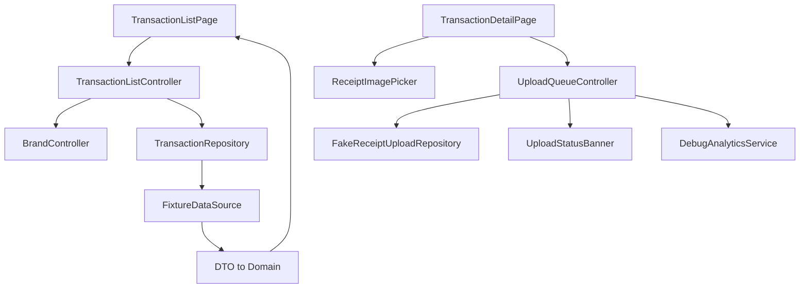

# Corporate Card Companion

Flutter demo for a fictional corporate card receipt workflow. The app helps a corporate card user find transactions missing receipts, attach a receipt image, and keep browsing while a mock upload runs.

This project is a demo. It does not copy UPSIDER trademarks, logos, screenshots, exact colors, or private UI. All data is fictional.

## Problem

Corporate card users often need to attach receipts after a purchase. The friction points are simple but important:

- The user cannot quickly find transactions missing receipts.
- Uploading a receipt can block the screen or feel unreliable.
- A failed upload can lead to duplicate retries or unclear recovery.
- Multi-brand systems can leak data when `brandId` is treated as a UI filter instead of a data boundary.

The demo focuses on one path: open the app, filter missing receipts, enter a transaction, attach a receipt, start upload, and recover from failure.

## Screenshots

Current visual baselines are stored as Golden Test snapshots:

- [Transaction list](test/goldens/transaction_list.png)
- [Transaction detail](test/goldens/transaction_detail_missing_receipt.png)

These images are test baselines, not marketing screenshots. Flutter test uses a stable test font, so Japanese text may render as square glyphs in the PNGs.

## Run

```powershell
flutter pub get
flutter run -d chrome
```

Checks:

```powershell
dart format .
flutter analyze
flutter test
```

Update golden files after an intentional UI change:

```powershell
flutter test --update-goldens test\goldens\transaction_pages_golden_test.dart
```

Verified local environment:

- Flutter 3.41.2 stable
- Dart 3.11.0
- Android toolchain available
- Chrome available
- Windows desktop build has a Visual Studio installation warning

CI runs on GitHub Actions with Flutter 3.41.2 on `windows-latest`.

## Features

- Japanese Material 3 UI.
- Transaction list with loading, empty, error, retry, filter chips, date grouping, and status badges.
- Transaction detail with amount, status, card last four, short demo transaction ID, memo, and receipt section.
- Receipt image selection through an injectable image picker abstraction.
- 200-character memo field.
- Nonblocking fake upload with progress.
- Global upload status banner visible after returning to the list.
- Duplicate active upload prevention for the same `brandId + transactionId`.
- Failed upload retry with the same `idempotencyKey`.
- Business / Executive brand switching from demo settings.
- Debug Analytics event log with a safe property whitelist.
- Golden, widget, and unit tests.

## Architecture

The app uses a lightweight feature-first structure:

```text
lib/
  app/
    app.dart
    router.dart
    brand/
      brand_config.dart
      brand_controller.dart
  core/
    analytics/
    formatting/
  features/
    transactions/
      domain/
      data/
      application/
      presentation/
    receipt_upload/
      domain/
      data/
      application/
      presentation/
    settings/
      presentation/
```

High-level flow:



### Why Riverpod

Riverpod handles both state and dependency injection. Repositories, analytics, image picker, current brand, and upload queue are all replaceable in tests. This keeps widgets from directly creating data sources or plugins.

### Why no mechanical Clean Architecture

The current flows are small. Adding one use-case class per action would add files without improving boundaries. Controllers orchestrate simple flows and depend on repository interfaces. If a business action becomes reused across multiple entry points, a use-case layer can be introduced later.

## Key Decisions

### Money uses integers

`Money` stores `minorUnits: int` and `currency`. The app never stores money as `double`, because financial values should not depend on floating-point precision. JPY is represented as integer yen, and formatting is kept outside the domain model.

### Upload state is app-level

Receipt upload state is stored in `UploadQueueController`, not inside the detail page. The user can leave the detail page while upload continues, and the list still shows progress.

This is app-process async work only. It is not OS background upload and does not survive app restart.

### Retry keeps the same idempotency key

Retry is treated as the same business submission. The failed job keeps its original `idempotencyKey`, so retry does not represent a new receipt submission.

### `brandId` is a data boundary

Repository calls require `brandId`. The app does not load all brand data and filter in the UI. Brand switching changes the app-level `BrandConfig`, then the transaction controller reloads data for that brand.

Upload jobs also carry `brandId`, so a Business upload banner is not shown after switching to Executive.

### Analytics is privacy-limited

Debug Analytics only keeps these properties:

- `brandId`
- `transactionStatus`
- `receiptStatus`
- `durationMs`
- `retryCount`
- `errorType`

It does not record merchant name, memo, image path, image content, raw transaction ID, card last four, or amount.

## Analytics and KPI

Tracked debug events:

- `app_opened`
- `transaction_list_viewed`
- `transaction_filter_changed`
- `transaction_detail_opened`
- `receipt_attach_tapped`
- `receipt_image_selected`
- `receipt_upload_started`
- `receipt_upload_succeeded`
- `receipt_upload_failed`
- `receipt_upload_retried`
- `brand_switched`

KPI definitions:

- Time to Receipt Upload: app open to first `receipt_upload_succeeded`.
- Upload Success Rate: `receipt_upload_succeeded / receipt_upload_started`.
- Retry Rate: `receipt_upload_retried / receipt_upload_started`.
- Missing Receipt Completion Rate: users who choose the missing-receipt filter and later reach upload success.
- Time on Task: `transaction_detail_opened` to `receipt_upload_started`.

Product hypotheses:

- Putting the missing-receipt summary on the list should shorten time to the target transaction.
- Nonblocking upload should reduce abandonment after starting upload.
- A local retry action should improve completion after a network-like failure.

## Tests

Current coverage:

- Money and DTO mapping.
- Unknown status rejection.
- Transaction filtering.
- Brand data isolation in fixture repository.
- Loading, error, retry, filtering, detail, image selection, upload, and retry widget flows.
- Duplicate active upload prevention.
- Retry preserving the same idempotency key.
- Brand switching, old-brand detail invalidation, and brand-scoped upload banner visibility.
- Analytics property whitelisting.
- Upload banner semantics.
- Large text and small-screen layout smoke check.
- List and detail Golden Test baselines.

Latest local result:

```text
flutter analyze
No issues found

flutter test
26 tests passed
```

## Demo Flow

1. Open `利用明細`.
2. Filter by `証憑未提出`.
3. Open a transaction detail.
4. Attach a receipt image and start upload.
5. Return to the list and confirm upload progress remains visible.
6. Simulate upload failure in `デモ設定`, then retry.
7. Switch between Business and Executive brands and confirm data isolation.
8. Open recent analytics events in `デモ設定` and review KPI-related events.

Key points to highlight:

- Async loading, error, retry, empty, and data states are explicit.
- Upload state is app-level, not tied to the detail page lifecycle.
- Retry keeps the same `idempotencyKey`.
- Repository calls use explicit `brandId`.
- Analytics uses a strict property whitelist.
- Unit, widget, semantics, and golden tests cover the core behavior.

## AI / Codex Usage

Codex was used to accelerate implementation, testing, code review, and documentation across phases.

Manual decisions and checks included:

- Keeping each phase small and stopping before the next phase.
- Avoiding real payment, real backend, real OCR, real AI API, login, push notification, and OS background upload.
- Choosing integer money representation.
- Keeping `brandId` as a repository and upload boundary.
- Preserving idempotency key on retry.
- Filtering analytics properties by whitelist.
- Running `dart format .`, `flutter analyze`, and `flutter test`.

The demo is not presented as AI-generated output. It is presented as a small Flutter product whose architecture, tradeoffs, risks, and tests can be explained and defended.

## Known Limits

- Uses fixture JSON only.
- No real authentication.
- No real payment, card issuing, authorization, clearing, refund, fraud, or accounting integration.
- No real backend.
- No real OCR, LLM, or third-party AI API.
- No local database or durable queue.
- Upload is app-process async work only and resets on restart.
- Debug Analytics is in memory and resets on restart.
- Brand switching uses local in-memory config only, not remote brand configuration, build flavors, or separate branded apps.
- Golden files are local Flutter test baselines and may need regeneration after intentional UI changes.
- The app does not claim PCI DSS or production security compliance.
